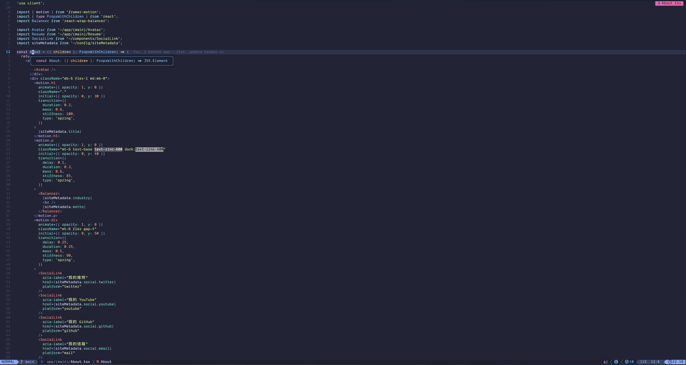
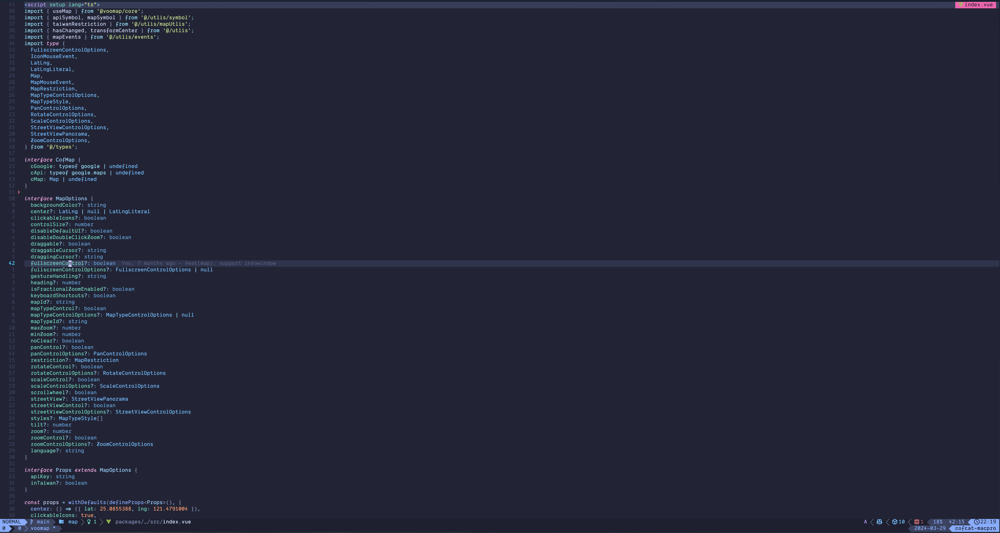

# CofCat: Frontend Neovim Config


### Welcome to my world! 

## :wrench:  Features

- Configured for TypeScript Development (React, Next, Vue 3, Nuxt)
- Cool default theme: [Tokyonight](https://github.com/folke/tokyonight.nvim)
- Lazy loaded via [lazy.nvim](https://github.com/folke/lazy.nvim)
- Extendable LSP configuration via [mason.nvim](https://github.com/williamboman/mason.nvim)
- Support for [TailwindCSS](https://tailwindcss.com/) with highlighted colors

And of course usage of [telescope](https://github.com/nvim-telescope/telescope.nvim), [bufferline](https://github.com/akinsho/bufferline.nvim), [cmp](https://github.com/hrsh7th/nvim-cmp), [treesitter](https://github.com/nvim-treesitter/nvim-treesitter) & more!

## :camera:  Screenshots

Dashboard


Overview (React Project)




Overview (Vue Project)



## Initial setup

> [!Note]
>
> I'm using macOS.

```bash
git clone git@github.com:CofCat456/dot.git
```

### Install

```bash
sh install.sh
```

#### `macos`

The `macos` command sets up macOS-specific configurations using the
`defaults write` commands to change default values for macOS.

- Finder: show all filename extensions
- show hidden files by default
- only use UTF-8 in Terminal.app
- expand save dialog by default
- Enable full keyboard access for all controls (e.g. enable Tab in modal
  dialogs)
- Enable subpixel font rendering on non-Apple LCDs
- Use current directory as default search scope in Finder
- Show Path bar in Finder
- Show Status bar in Finder
- Disable press-and-hold for keys in favor of key repeat
- Set a blazingly fast keyboard repeat rate
- Set a shorter Delay until key repeat
- Enable tap to click (Trackpad)
- Enable Safari’s debug menu

## Please Enjoy :)
