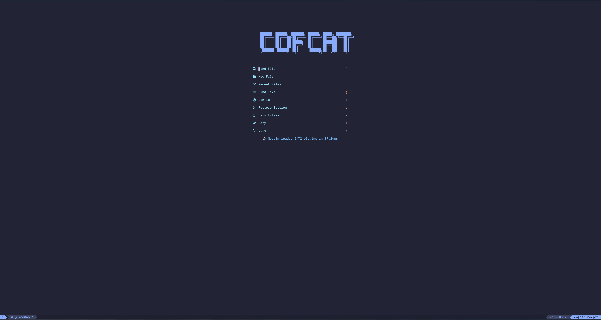
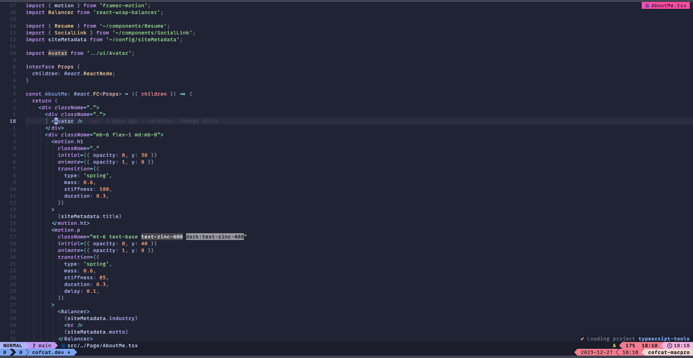

# CofCat: Frontend Neovim Config

### My Dot Files 

## :wrench:  Features

- Configured for TypeScript Development (React, Next, Vue 3, Nuxt.)
- Cute default theme: [Catppuccin](https://github.com/catppuccin/nvim)
- Lazy loaded via [lazy.nvim](https://github.com/folke/lazy.nvim)
- Extendable LSP configuration via [mason.nvim](https://github.com/williamboman/mason.nvim)
- Support for [TailwindCSS](https://tailwindcss.com/) with highlighted colors
- Current code context via [nvim-navic](https://github.com/SmiteshP/nvim-navic)
- Using lualine with the Catppuccino theme [lualine.nvim](https://github.com/nvim-lualine/lualine.nvim) 

And of course usage of [telescope](https://github.com/nvim-telescope/telescope.nvim), [bufferline](https://github.com/akinsho/bufferline.nvim), [cmp](https://github.com/hrsh7th/nvim-cmp), [treesitter](https://github.com/nvim-treesitter/nvim-treesitter), [blankline](https://github.com/lukas-reineke/indent-blankline.nvim) & more!

## :camera:  Screenshots

Dashboard

Overview

